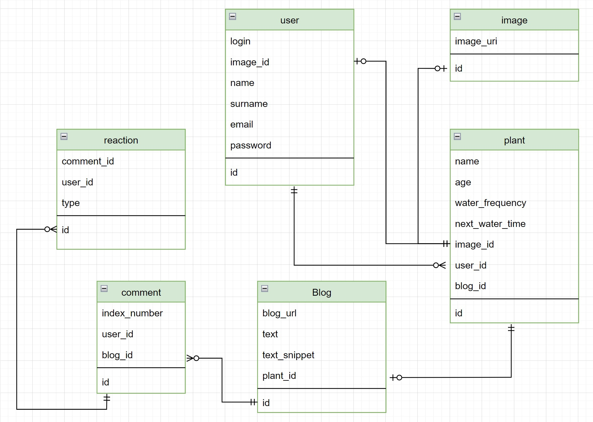

# MyPlant

## Описание проекта

Это приложение для удобного планирования ухода за своими домашними растениями, позволяющее вести блог о каждом из них.

### Функционал

Вы сможете:

<ul>
<li> Добавлять свои растения с характеристиками и особенностями ухода;
<li> Искать уже имеющиеся растения в базе данных;
<li> Добавлять описания к своим растениям (блог);
<li> Обновлять даты ухода, в случае пропуска каких-то запланированных событий;
<li> Удалять кастомные растения;
<li> Писать комментарии к блогам других пользователей.
</ul>

## Макет проекта

[Ссылка на проект в figma](https://www.figma.com/file/6r9ioeLZlLxAEhCSosNBmf/MyPlant?type=design&node-id=87%3A4&mode=design&t=hf8PdyEipdVy6u5o-1)

## Запуск

Добавлена возможность запуска backend'а через <code>docker compose</code>. В качетсве базы банных используется <code>posgresql</code>. Что для этого нужно сделать:

* Перейти в директорию проекта
* <code>cd backend/myplant</code>
* <code>mvn package -DskipTests</code>
* <code>cd ../../</code>
* <code>docker compose build</code>
* <code>docker compose -p *ваше-имя* up -d</code>

Чтобы остановаить работу backend'а, необходимо исполнить следующую команду из директории проекта:

<code>docker compose -p *ваше-имя* down</code>

## Текущий функционал

* На главной странице две рабочие кнопки:
    + "Войти": можно ввести логин, ввести пароль, в консоль выведутся и логин, и пароль. Если попытаться перейти на страницу welcome, ничего не введя, приложение не даст это сделать. Также из страницы ввода логина можно войти на страницу регистрации. Регистрация также не позволяет зайти дальше, если не все поля заполнены или поля с паролем не совпадают. 
    + "Начать": переводит пользователя на страницу с популярными блогами.
* Можно листать записи и переходить к ним по кнопке разворот записи -> к записи. На страницу записи можно добавлять комментарии и нажимать кнопки "нравится" и "не нравится" на комментариях.
* Добавлен функционал бекенда при помощи java spring, он позволяет зарегистрироваться, добавлять и удалять растения. После нажатия на кнопку "К моим записям" на странице с популярными блогами теперь, не будучи авторизованным, нельзя попасть на страницу профиля. После авторизации кнопка "Войти" на главном экране меняется на кнопку "Личный кабинет".
* Кнопка "Сбросить полив" теперь имеет функционал: она сбрасывает дату на текущую.

## Макет базы данных

## User Stories

<ul>
<li> Необходима возможность создавать растение, только по названию
<li> Необходима возможность сбрасывать время полива растения
<li> Необходима возможность просматривать популярные блоги растений всем пользователям вне зависимости от авторизации
<li> Необходима возможность удалять растение
<li> Необходима возможность редактировать информацию о пользователе
<li> Необходима возможность регистрироваться и логиниться в систему
<li> Необходима возможность добавлять блог к растению после его создания, потому что идея для истории может прийти потом, а пользоваться планировщиком хочется сейчас.
<li> Хотелось бы иметь возможность для распространённых названий растений подгружать интервал полива из базы данных по умолчанию.
<li> Хотелось бы по названию растений находить популярные записи про них или базовую информацию по поливу (использовать веб-приложение как агрегатор знаний о домашних растениях)
</ul>

## Дальнейшая работа

Список в порядке приоритета.
<ul>
<li> Научиться загружать изображения.
<li> Добавить возможность отвечать на комментарии.
</ul>
